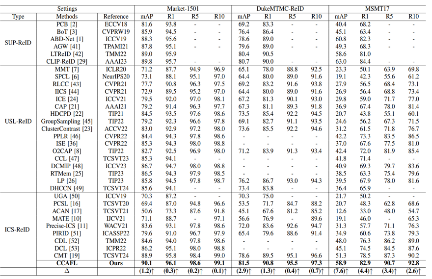

<p align="center">
  <h1 align="center">CLIP-based Camera-Agnostic Feature Learning for Intra-camera Supervised Person Re-Identification</h1>
  <p align="center">
    <a href="https://scholar.google.com.tw/citations?hl=zh-CN&user=3jWe9KAAAAAJ" rel="external nofollow noopener" target="_blank"><strong>Xuan Tan</strong></a>
    ·
    <a href="https://scholar.google.com.tw/citations?user=7PqgUw4AAAAJ&hl=zh-CN&oi=sra" rel="external nofollow noopener" target="_blank"><strong>Xun Gong</strong></a>
    ·
    <a href="https://scholar.google.com.tw/citations?user=oW4vMVkAAAAJ&hl=zh-CN&oi=sra" target="_blank"><strong>Yang Xiang</strong></a>
  </p>
<p align="center">
 <a href="https://arxiv.org/abs/2409.19563" rel="external nofollow noopener" target="_blank">Arxiv Paper Link</a>
<p align="center">
 <a href="https://ieeexplore.ieee.org/document/10813454" rel="external nofollow noopener" target="_blank">IEEE Paper Link</a>

  
### Method


This is an official code implementation of "CLIP-based Camera-Agnostic Feature Learning for Intra-camera Supervised Person Re-Identification".

### Update Time
-- 2024-12 The code has released!!!
 
-- 2024-12 CCAFL is accepted by TCSVT25! 🎉🎉

-- 2024-9 We will release the code when the paper is accepted.

### Preparation

Download the datasets:

For privacy reasons, we don't have the dataset's copyright. Please contact authors to get this dataset.

```

Market-1501-v15.09.15/
├── bounding_box_test
├── bounding_box_train
├── gt_bbox
├── gt_query
└── query

MSMT17/
├── bounding_box_test
├── bounding_box_train
└── query

DukeMTMC-reID/
├── bounding_box_test
├── bounding_box_train
└── query

```

## Training
```shell
sh train.sh 
```

## Performance



### Intra-camera Supervised Person ReID

##### Market-1501
| Model        |Pretrained	 | Image Size|Paper | Download |
| :------:     |  :------: | :------: |:------: |:------: |
| Resnet50     | CLIP | 256*128 |90.1/96.0 |[model](https://drive.google.com/file/d/1-o7XVkheqhIUV_QUayqmp0goO87xSf4Y/view?usp=drive_link) / [log](https://drive.google.com/file/d/1TeoGPORL3HjzHIejbNH4h-8lHk8FaXwE/view?usp=drive_link)|

##### MSMT17
| Model      |Pretrained  | Image Size|Paper | Download |
| :------:     |  :------: |  :------: |:------: |:------: |
| Resnet50    | CLIP | 256*128 |58.9/82.9 |[model](https://drive.google.com/file/d/1EI5Bv9Y_bZISW9Cql7-VXIuspfPtcEwc/view?usp=drive_link) / [log](https://drive.google.com/file/d/1e_aOp7RJd4Zc3cKn_VfmEFZ9Y7SnazLT/view?usp=drive_link)|

##### DukeMTMC-ReID
| Model     |Pretrained    | Image Size|Paper | Download |
| :------:    |  :------:    | :------: |:------: |:------: |
| Resnet50    | CLIP | 256*128 |81.5/90.8 |[model](https://drive.google.com/file/d/1c_bJlIe42ByHoKBkhNDMfZ56bNv5R3cu/view?usp=drive_link) / [log](https://drive.google.com/file/d/1tpXkMR5xEwZ-sAXk_7Tard7bfXqBGbKv/view?usp=drive_link)|

## Citation
If our work is helpful for your research, please consider citing:
```bibtex
@ARTICLE{10534060,
  author={Gong, Xun and Tan, Xuan and Xiang, Yang},
  journal={IEEE Transactions on Circuits and Systems for Video Technology}, 
  title={Contrastive Mean Teacher for Intra-camera Supervised Person Re-Identification}, 
  year={2024},
  volume={},
  number={},
  pages={1-1},
  keywords={Cameras;Pedestrians;Training;Feature extraction;Computational modeling;Lighting;Data models;Intra-camera supervision;Mean Teacher;Contrastive learning;Person re-identification},
  doi={10.1109/TCSVT.2024.3402533}}

@unknown{unknown,
author = {Tan, Xuan and Gong, Xun and Xiang, Yang},
year = {2024},
month = {09},
pages = {},
title = {CLIP-based Camera-Agnostic Feature Learning for Intra-camera Person Re-Identification},
doi = {10.48550/arXiv.2409.19563}
}
```

## Acknowledgements

